# L738 - No Author Left Behind - Develop SPAs That Are Fast, Engaging, and Editable

## Table of Contents

* [Lab Overview](#lab-overview) 10 minutes
* [Lesson 1 - SPA Starter Kit](#lesson-1---spa-starter-kit) 10 minutes
* [Lesson 2 - Hello World](#lesson-2---hello-world) 5 minutes
* [Lesson 3 - WKND Events](#lesson-3---wknd-events-app) 5 minutes
* [Lesson 4 - JSON Contract](#lesson-4---json-contract) 5 minutes
* [Lesson 5 - Front-end Development](#lesson-5---front-end-development) 15 minutes
* [Lesson 6 - Back-end Development](#lesson-6---back-end-development) 10 minutes
* [Lesson 7 - Navigation and Routing](#lesson-7---navigation-and-routing) 10 minutes (Discussion, no coding)
* [Lesson 8 - Server Side Rendering](#lesson-8---server-side-rendering) 10 minutes
* [Next Steps](#next-steps)
* [Appendix](#appendix)


## Lab Overview

As brands move to Single Page Applications (SPA), too often the digital marketer has minimal control over content and layout decisions. With the SPA Editor framework in Adobe Experience Manager, digital marketers are no longer left out of the process. Front-end developers continue to build highly performant and rich experiences, while enabling content authors to make in-context editorial updates.

### Key Takeaways

* Use modern web development tools of npm and webpack to streamline front-end developer workflow with traditional AEM 
* Map front-end components in React or Angular to back-end data models in Adobe Experience Manager
* Optimize the application with server-side rendering

### Prerequisites

A local development environment with the following tools and technologies installed:

#### Adobe Experience Manager

A local author instance of AEM should be installed running locally on port 4502

* [AEM 6.5](#)
* [AEM 6.4 + SP2](https://helpx.adobe.com/experience-manager/6-4/release-notes/sp-release-notes.html)

#### Tools

* [Java 1.8](http://www.oracle.com/technetwork/java/javase/downloads/index.html)
* [Apache Maven](https://maven.apache.org/) (3.3.9 or newer)
* [Node.js v10+](https://nodejs.org/en/)
* [npm 6+](https://www.npmjs.com/)

#### IDE

The lab will use Visual Studio Code as the IDE and screenshots will be of Visual Studio Code. IntelliJ, Eclipse are also perfectly valid IDEs to work in. 

See [Set up a Local AEM Development Environment](https://helpx.adobe.com/experience-manager/kt/platform-repository/using/local-aem-dev-environment-article-setup.html) for detailed instructions.

* [Visual Studio Code](https://code.visualstudio.com/) with [Repo](https://github.com/Adobe-Marketing-Cloud/tools/tree/master/repo#integration-into-visual-studio-code)

Start by double checking that the above tools have been installed and available via the command line path. 

Open up a new terminal and run the following commands:

```shell
$ java -version
java version "1.8.+"
Java(TM) SE Runtime Environment (build 1.8.0_111-b14)
Java HotSpot(TM) 64-Bit Server VM (build 25.111-b14, mixed mode)
  
$ mvn -version
Apache Maven 3.3.9
Maven home: /Library/apache-maven-3.3.9
Java version: 1.8.0_111, vendor: Oracle Corporation
Java home: /Library/Java/JavaVirtualMachines/jdk1.8.0_111.jdk/Contents/Home/jre
  
$ node --version
v10.8.0
  
$ npm --version
6.2.0
```

## Angular + React

This lab has been written so that participants can complete the lab in either Angular or React frameworks. Throughout the manual you may see indicator icons like the following:

####  Exercise xyz (React only)

or

####  Exercise xyz (Angular only)

Complete only the exercise that corresponds to the framework you have chosen. 

**Or if you are ambitious do both!**

## Lab Resources

There are a number for files that will be used in the lab. If completing this lab in person, the files are already downloaded to the Desktop under a folder named `resources`. You can also find the same [resources online in the git repository](./resources).

## Lesson 1 - SPA Starter Kit 

### Objective

1. Learn the best practices for starting a new SPA enablement project with the [Maven Archetype for SPA Starter Kit](https://github.com/adobe/aem-spa-project-archetype/tree/master).
2. Learn how a webpack project's build artifacts can be integrated and deployed as an AEM client library.
3. Understand how the plugins of [aem-clientlib-generator](https://www.npmjs.com/package/aem-clientlib-generator) and [frontend-maven-plugin](https://github.com/eirslett/frontend-maven-plugin) are used to automate the build process.

### Lesson Context

SPA development will be done primarily in a webpack project outside of AEM. This offers several advantages:

* Separation of front-end and back-end concerns. 
* Front-end tooling has a very rapid lifecycle. By moving the front-end development outside of AEM, it ensures that the latest and greatest versions of these tools can be used, independent of the version of AEM.

At a high level, the integration approach is as follows: 

1. A webpack production build is triggered.
2. The compiled SPA, the production distribution of CSS and JS, is copied into the **ui.apps** module as an AEM [client library](https://helpx.adobe.com/experience-manager/6-4/sites/developing/using/clientlibs.html)
3. The **ui.apps** is deployed to AEM as part of an AEM package. 


The concept is similar to the integration of the **core** Java bundle, where the Java bundle is compiled into a jar file that is embedded into the **ui.apps** module and deployed to AEM as an AEM package.

To achieve this integration two tools will be used:

* [aem-clientlib-generator](https://www.npmjs.com/package/aem-clientlib-generator) - used to transform compiled CSS and JS files into an AEM client library
* [frontend-maven-plugin](https://github.com/eirslett/frontend-maven-plugin) - used to trigger NPM commands via a Maven build. This plugin will download/install Node and NPM locally for the project, ensuring consistency and making the project easy to integrate with a Continuous Integration/Continuous Deployment environment.

###  Exercise 1.1 - Open the L738 SPA React Project

1. The [Maven Archetype for SPA Starter Kit](https://github.com/adobe/aem-spa-project-archetype/tree/master) was used to create a new SPA project with React. The following [parameters](./resources/lesson-1/React-archetype-params.txt) were used:

    ```
    mvn archetype:generate -B \
        -DarchetypeCatalog=local  \
        -DarchetypeGroupId=com.adobe.cq.spa.archetypes  \
        -DarchetypeArtifactId=aem-spa-project-archetype  \
        -DarchetypeVersion=1.0.3-SNAPSHOT \
        -Dpackage=summitlab \
        -DgroupId=com.adobe.summit \
        -DartifactId=L738-spa-react \
        -Dversion=0.0.1-SNAPSHOT \
        -DprojectTitle="L738 SPA React App"  \
        -DprojectName=L738-react  \
        -DcomponentGroup="L738 React Content" \
        -DoptionFrontend=react
    ```

2. Open **Visual Studio Code** IDE
3. Click **Open Folder** and navigate to **Desktop** > **resources** > **lesson-1** > **L738-spa-react**
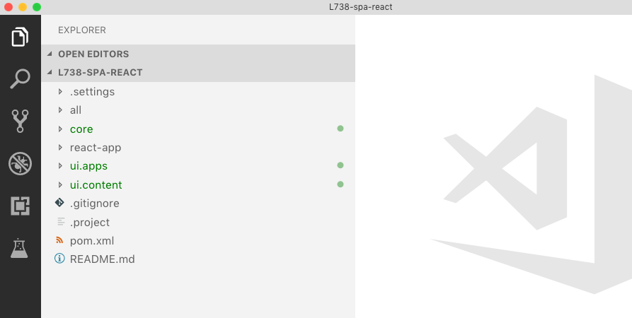
4. There are 5 folders in the project that represent individual Maven modules
    * **all** Combines all modules in a single package
    * **core**: OSGi bundle containing Java code
    * **react-app** React application
    * **ui.apps** - AEM components and dialog definitions
    * **ui.content** - AEM templates and configurations
5.  Beneath the **react-app** folder, open the file: `package.json`. Inspect the **npm** scripts **build** command:

    `"build": "react-scripts build && clientlib --verbose"`

    This will trigger a production build of the react application and then copy the compiled JS and CSS into an AEM Client library.
6. Beneath the **react-app** folder, open the file: `clientlib.config.js`. This is the [aem-clientlib-generator](https://www.npmjs.com/package/aem-clientlib-generator) used to transform the production build of the react app into an AEM client library that will be copied into the **ui.apps** folder.

###  Exercise 1.2 - Build the L738 SPA React Project

1. In **Visual Studio Code** from menu bar > **Terminal** > **New Terminal**

    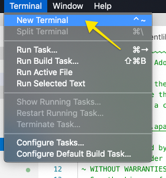

2. The terminal should default to be in the directory: `~/Desktop/resources/lesson-1/L738-spa-react`.
3. Run the following command in the terminal:

    ```
    $ mvn -PautoInstallPackage clean install
    ```
    This will build and deploy the application to a local instance of AEM running at [http://localhost:4502](http://localhost:4502).

    ```
    [INFO] ------------------------------------------------------------------------
    [INFO] Reactor Summary:
    [INFO]
    [INFO] L738 SPA React App Reactor ......................... SUCCESS [  0.300 s]
    [INFO] L738 SPA React App Core ............................ SUCCESS [  6.849 s]
    [INFO] L738 SPA React App React App ....................... SUCCESS [ 32.572 s]
    [INFO] L738 SPA React App - SPA UI apps ................... SUCCESS [  1.152 s]
    [INFO] L738 SPA React App - SPA UI content ................ SUCCESS [  0.644 s]
    [INFO] L738 SPA React App All-in-One ...................... SUCCESS [  0.885 s]
    [INFO] ------------------------------------------------------------------------
    [INFO] BUILD SUCCESS
    [INFO] ------------------------------------------------------------------------
    [INFO] Total time: 43.965 s
    [INFO] Finished at: 2019-01-25T17:27:13-05:00
    [INFO] Final Memory: 55M/714M
    ```
4. Open a new browser and navigate to AEM: [http://localhost:4502](http://localhost:4502).
5. Login using the credentials:
    * User name: **admin**
    * Password: **admin**
6. Click **Tools** > **Deployment** > **Packages** to navigate to CRX Package Manager:

    

7. You should see that the package has been deployed:

    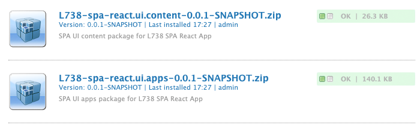


###  Exercise 1.1 - Open the L738 SPA Angular Project

1. The [Maven Archetype for SPA Starter Kit](https://github.com/adobe/aem-spa-project-archetype/tree/master) was used to create a new SPA project with Angular. The following [parameters](./resources/lesson-1/Angular-archetype-params.txt) were used:

    ```
    mvn archetype:generate -B \
     -DarchetypeCatalog=local  \
     -DarchetypeGroupId=com.adobe.cq.spa.archetypes  \
     -DarchetypeArtifactId=aem-spa-project-archetype  \
     -DarchetypeVersion=1.0.3-SNAPSHOT \
     -Dpackage=summitlab \
     -DgroupId=com.adobe.summit \
     -DartifactId=L738-spa-angular \
     -Dversion=0.0.1-SNAPSHOT \
     -DprojectTitle="L738 SPA Angular App"  \
     -DprojectName=L738-angular  \
     -DcomponentGroup="L738 Angular Content" \
     -DoptionFrontend=angular
    ```

2. Open **Visual Studio Code** IDE
3. Click **Open Folder** and navigate to **Desktop** > **resources** > **lesson-1** > **L738-spa-angular**
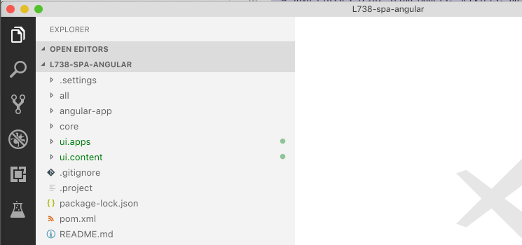
4. There are 5 folders in the project that represent individual Maven modules
    * **all** Combines all modules in a single package
    * **core**: OSGi bundle containing Java code
    * **angular-app** Angular application
    * **ui.apps** - AEM components and dialog definitions
    * **ui.content** - AEM templates and configurations
5.  Beneath the **angular-app** folder, open the file: `package.json`. Inspect the **npm** scripts **build** command:

    `"build": "ng build --build-optimizer=false && clientlib"`

    This will trigger a production build of the angular application and then copy the compiled JS and CSS into an AEM Client library.
6. Beneath the **angular-app** folder, open the file: `clientlib.config.js`. This is the [aem-clientlib-generator](https://www.npmjs.com/package/aem-clientlib-generator) used to transform the production build of the angular app into an AEM client library that will be copied into the **ui.apps** folder.

###  Exercise 1.2 - Build the L738 SPA Angular Project

1. In **Visual Studio Code** from menu bar > **Terminal** > **New Terminal**

    

2. The terminal should default to be in the directory: `~/Desktop/resources/lesson-1/L738-spa-angular`.
3. Run the following command in the terminal:

    ```
    $ mvn -PautoInstallPackage clean install
    ```
    This will build and deploy the application to a local instance of AEM running at [http://localhost:4502](http://localhost:4502).

    ```
    [INFO] ------------------------------------------------------------------------
    [INFO] Reactor Summary:
    [INFO]
    [INFO] L738 SPA Angular App Reactor ....................... SUCCESS [  0.306 s]
    [INFO] L738 SPA Angular App Core .......................... SUCCESS [  6.495 s]
    [INFO] L738 SPA Angular App Angular App ................... SUCCESS [ 34.384 s]
    [INFO] L738 SPA Angular App - SPA UI apps ................. SUCCESS [  1.922 s]
    [INFO] L738 SPA Angular App - SPA UI content .............. SUCCESS [  0.615 s]
    [INFO] L738 SPA Angular App All-in-One .................... SUCCESS [  1.137 s]
    [INFO] ------------------------------------------------------------------------
    [INFO] BUILD SUCCESS
    [INFO] ------------------------------------------------------------------------
    [INFO] Total time: 46.440 s
    [INFO] Finished at: 2019-01-25T17:44:17-05:00
    [INFO] Final Memory: 59M/707M
    ```
4. Open a new browser and navigate to AEM: [http://localhost:4502](http://localhost:4502).
5. Login using the credentials:
    * User name: **admin**
    * Password: **admin**
6. Click **Tools** > **Deployment** > **Packages** to navigate to CRX Package Manager:

    

7. You should see that the package has been deployed:

    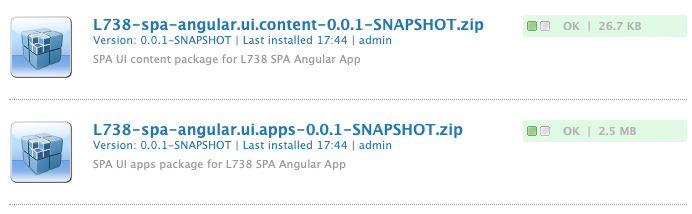

## Lesson 2 - Hello World

### Objective

1. As an AEM author, add a text component to the page and author a new message.
2. Learn where authored content is persisted in the JCR and how this content is exposed as JSON.
3. Understand how a front-end component is mapped to an AEM component based on a Sling resource type.

### Lesson Context

The goal of the SPA Editor is to allow marketers to be able to make in-context edits to a Single Page Application. In this lesson we will trace how authored content is persisted to the JCR and then exposed as JSON. We will then look at how the SPA inspects the JSON to map the data model to a front-end component. The **Text** component which is included out of the box by the SPA Starter Kit will be used.

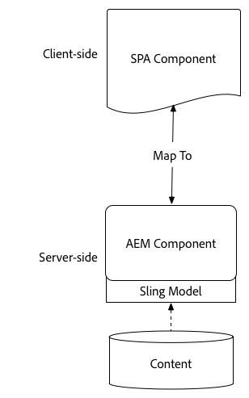

#### Exercise 2.1 Add a text component to the page and author a new message

1. Display the home page of the SPA in the page editor by navigating to http://localhost:4502/editor.html/content/wknd-events/react/home.html
2. If necessary, log in to the instance using _admin_ as _User name_ and _Password_
3. If prompted _Close_ the Onboarding modal
    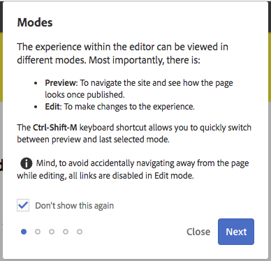
4. Select the text component that contains the word _Home_
    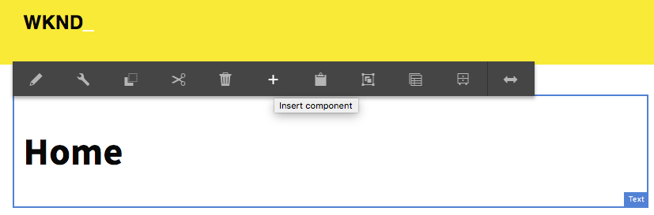
5. On the action bar, click on the button titled _Insert component_
6. In the _Insert New Component_ dialog, select on the _Text_ entry
    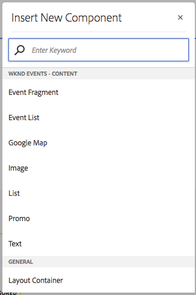
7. Select the newly created text component
8. On the action bar, click on the _Edit_ button to start inline editing the content of the text component
9. In the editable section, type in the word _test_
10. Validate the change by clicking the _Save_ button of the contextual action bar of the text component
    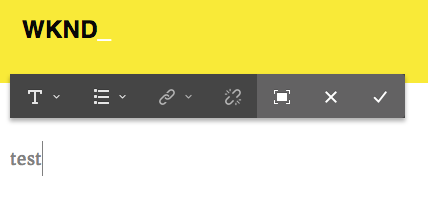

##### Exercise 2.1.1 Visualize the persisted data

1. Visualize the data in CRXDE lite by navigating to 
- Angular: http://localhost:4502/crx/de/index.jsp#/content/wknd-events/angular/home/jcr%3Acontent/root/responsivegrid/responsivegrid
- React: http://localhost:4502/crx/de/index.jsp#/content/wknd-events/react/home/jcr%3Acontent/root/responsivegrid/responsivegrid
2. Select the first child node prefixed with *text_*

In the properties tab, you can observe the data associated with the text component you created
    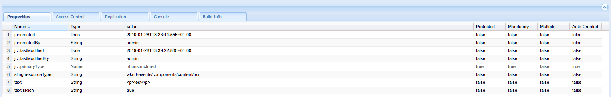

##### Exercise 2.1.2 Visualize the serialized data

1. Open a new tab in your browser
2. Display the data model of the home page by navigating to http://localhost:4502/content/wknd-events/react/home.model.json
3. In the page, search for the word _test_
    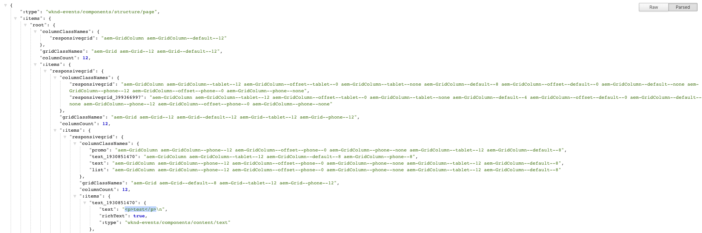

Observe the JSON data structure to have a better idea of how your component is represented. Note the internal fields prefixed with the colon character. These fields are mostly used by the SPA SDK to traverse the hierarchy of components and enable the dynamic instantiation of components. We will explore further how the model of the component is generated on the backend in [Lesson 6 - Back-end Development](#lesson-6---back-end-development)

##### Exercise 2.1.3 Visualize the frontend text component source code

1. Open the _WKND - Events_ project in your IDE
2. Open the file(s) containing the source code of the text componenent
```
// Angular: 
    - Script:
    angular-app/src/app/components/text/text.component.ts, 
    - Template: 
    angular-app/src/app/components/text/text.component.html

// React: 
    react-app/src/components/text/Text.js
```

Note how the _text_ field is made available and how it is being applied to the component

## Lesson 3 - WKND Events App

### Objective

1. Install the **WKND Events App** to a local AEM instance.
2. Inspect a more mature SPA that was built based on the SPA Starter kit.
3. Understand advanced use cases with the SPA Editor with **List** and **Content Fragment** components.

### Lesson Context

In this lesson we will install the WKND Events App. This application displays a series of upcoming events and information for the ficticious life-style brand WKND. The application provides an example how structured data can be combined with editorial content to create a rich and compelling experience. In the following lessons, the WKND Events App will be extended. 

#### Exercise 3.1

## Lesson 4 - JSON Contract

### Objective

1. Create a new component by starting with the JSON structure.
2. Learn how creating a JSON contract upfront can facilitate Front-end and back-end development in parallel.
3. Plan what parts of the component will be editable and the impact this has on the development responsibilities.

### Lesson Context

When planning a new component it is important to start with the JSON structure that will ultimately drive the SPA component. By defining the expected JSON structure upfront this allows both front-end and back-end developers to begin working in parallel. 


#### Back-end developer

A new business requirement for the WKND Events App is to create a teaser-like component for Sponsored content. The mockups for the app are below:

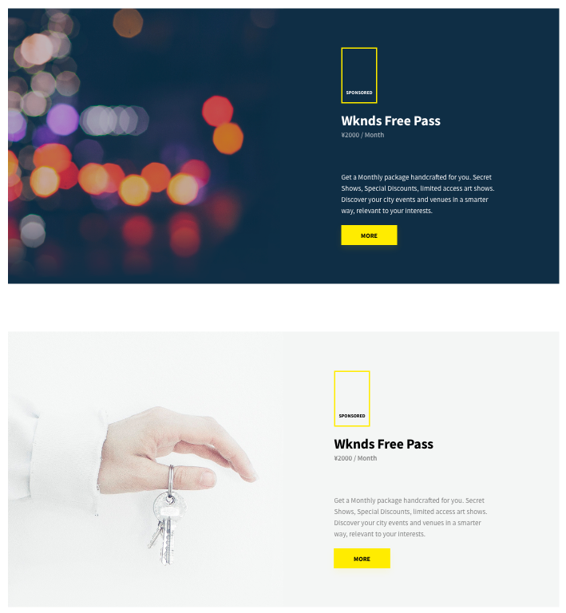
> WKND Events - Sponsored Content

 

#### Exercise 4.1

## Lesson 5 - Front-end Development

### Objective

1. Register a frontend component to map a backend data structure.
2. Learn how the data structure served by AEM is transformed into component properties.
3. Drive the content author experience from the frontend component.
4. Understand the role played by the ModelManager.
5. Get to know the main components provided by the SPA SDK.
6. Observe components becoming editable.

### Lesson Context

The lesson illustrates how editable frontend components are developed and how the AEM data is provided as properties. Get more familiar with the notion of library of frontend component and the dynamic instantiation of components. Better understand the motivations and advantages of delegating the content structure to AEM. Learn how to support the author's experience from within the frontend project.

#### Exercise 5.1

## Lesson 6 - Back-end Development

### Objective

1. Familiarize yourself with the Sling Model Exporter.
2. Discover the interfaces that are at the heart of the communication layer between AEM and the frontend libraries.
3. Expose a new field by adding a simple getter.

### Lesson Context

The lesson explores how data is processed and serialized. Implement the interfaces that constitute the main building blocks of the data structure exposed to the frontend libraries. As the project progresses, expose new fields.

#### Exercise 6.1

## Lesson 7 - Navigation and Routing

### Objective

1. Understand relationship and differences between the App routing and the ModelRouter.
2. Consider the multiple degrees of editing capabilities: Portability and re-usability of the frontend script.

### Lesson Context

The lesson exposes the relationship and differences between the App routing and the ModelRouter. Optimize the data model initially delivered to the App and let the ModelRouter asynchronously load the remaining data. Learn how to build your frontend project to benefit from all the authoring capabilities offered by AEM.

#### Exercise 7.1

## Lesson 8 - Server Side Rendering

### Objective

1. Get more familiar with the Server Side Rendering of frontend components.
2. Improve the SEO of the project using Server Side Rendering.
3. Compare two possible SSR architectures and their trade-off.


### Lesson Context

The lesson provides examples of Server-Side Rendered SPA and exposes the main advantages of such an architecture. Compare different architectures and their trade-off.

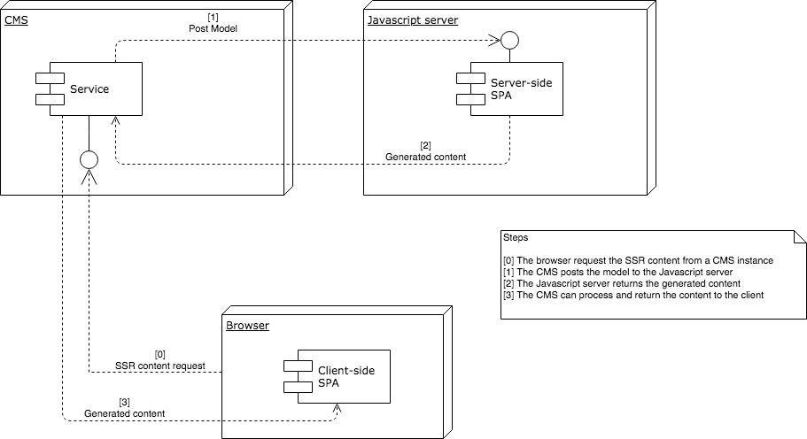

#### Exercise 8.1 Configure the Server-Side rendering

The _WKND - events_ project only contains a _React_ Server-Side environment. To proceed with the current exercise, please start with the provided initial content for chapter 8.

1. Modify the page component HTL template [a,b]
2. Start the local NODE.js server [c]
3. Request the page from your browser
4. Using a web browser, navigate to one of the pages of the app

a. Display the content of the HTL template for the body of the page component by navigating to the following URL
```
http://localhost:4502/crx/de/index.jsp#/apps/wknd-events/components/structure/page/body.html
```

b. Modify the content of the template as follow
```
<app-root id="root">
    <sly data-sly-resource="${resource @ resourceType='cq/remote/content/renderer'}" />
</app-root>
```

c. In your terminal, navigate inside the _react-app_ directory and execute the command to start the local _Node_ server
```
npm run start:server
```

d. Configure the AEM Remote HTML Renderer Servlet

5. Navigate to the System OSGi Configuration console (http://localhost:4502/system/console/configMgr)
6. Look for the configuration named `Remote Content Renderer - Configuration Factory`
7. Create a new configuration and set the after-mentioned field as follow

```
Content path pattern=/content/wknd-events/react(.*)
```

8. In your browser, display the Server-Side rendered home page of the SPA by navigating to http://localhost:4502/content/wknd-events/react/home.html 
9. Open the developer console, open the Network tab (alt+cmd+i)
10. Activate the filter called _XHR_
11. Refresh the page

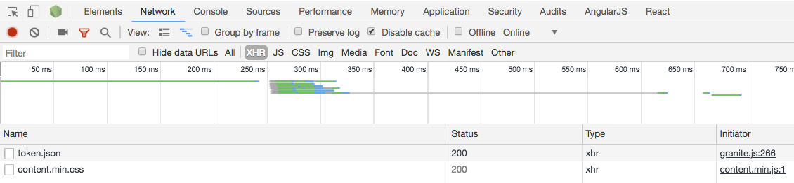

Note that there is no request to any model which would implay an entry for a URL ending with a the selector and extension such as _.model.json_

12. Open the page source of the page (alt+cmd+u or cmd+click > View Page Source)
13. In the page source, look for the tag with the id *__INITIAL_STATE__*

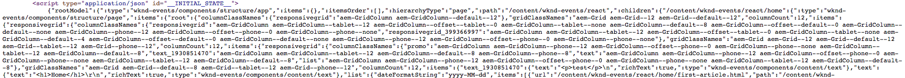

The page source exposes a source code that hasn't yet been manipulated by the SPA script. Note that the server-side script has dumped the JSON model object used to generate the initial content of the app. Finally, the frontend script present in the browser synchronizes itself with the provided JSON model object.

##### Exercise 8.1.1 Server-Side Rendering Fallback

Let's simulate a failure of the remote node server.

1. Kill the _Node_ server instance (ctrl+c)
2. Refresh the page source

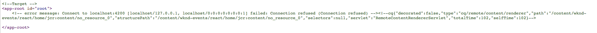

Note that in the `<app-root id="root">` tag is displayed a comment that contains the error code and message.

3. Refresh the page

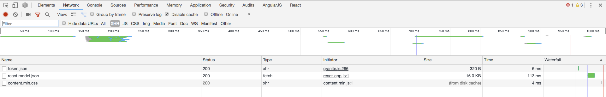

Note that a request to the model of the app is sent to the AEM server. The client script is has not been synchronized and initialize itself independently from the server.

## Next Steps

At the end of your lab manual it is recommended to include a **Next Steps** section for lab attendees to continue learning.

## Additional Resources

## Appendix

An appendix section is also a nice to have and include reference links to documentation.
