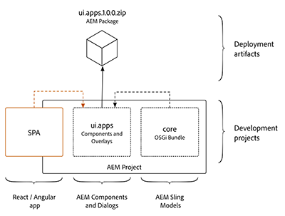

# L738 - No Author Left Behind - Develop SPAs That Are Fast, Engaging, and Editable


## Table of Contents

* [Lab Overview](#lab-overview)
* [Lesson 1 - SPA Starter Kit](#lesson-1---spa-starter-kit)
* [Lesson 2 - Hello World](#lesson-2---hello-world)
* [Lesson 3 - WKND Events](#lesson-3---wknd-events-app)
* [Lesson 4 - JSON Contract](#lesson-4---json-contract)
* [Lesson 5 - Front-end Development](#lesson-5---front-end-development)
* [Lesson 6 - Back-end Development](#lesson-6---back-end-development)
* [Lesson 7 - Server Side Rendering](#lesson-7---server-side-rendering)
* [Next Steps](#next-steps)


## Lab Overview

As brands move to Single Page Applications (SPA), too often the digital marketer has minimal control over content and layout decisions. With the SPA Editor framework in Adobe Experience Manager, digital marketers are no longer left out of the process. Front-end developers continue to build highly performant and rich experiences, while enabling content authors to make in-context editorial updates.

### Key Takeaways

* Use modern web development tools of npm and webpack to streamline front-end developer workflow with traditional AEM 
* Map front-end components in React or Angular to back-end data models in Adobe Experience Manager
* Optimize the application with server-side rendering

### Prerequisites

A local development environment with the following tools and technologies installed:

#### Adobe Experience Manager

A local author instance of AEM should be installed running locally on port 4502

* [AEM 6.5](#)
* [AEM 6.4 + SP2](https://helpx.adobe.com/experience-manager/6-4/release-notes/sp-release-notes.html)

#### Tools

* [Java 1.8](http://www.oracle.com/technetwork/java/javase/downloads/index.html)
* [Apache Maven](https://maven.apache.org/) (3.3.9 or newer)
* [Node.js v10+](https://nodejs.org/en/)
* [npm 6+](https://www.npmjs.com/)

#### IDE

The lab will use Visual Studio Code as the IDE and screenshots will be of Visual Studio Code. IntelliJ, Eclipse are also great IDEs to work with. 

See [Set up a Local AEM Development Environment](https://helpx.adobe.com/experience-manager/kt/platform-repository/using/local-aem-dev-environment-article-setup.html) for detailed instructions.

* [Visual Studio Code](https://code.visualstudio.com/) with [Repo](https://github.com/Adobe-Marketing-Cloud/tools/tree/master/repo#integration-into-visual-studio-code)

Start by double checking that the above tools have been installed and available via the command line path. 

Open up a new terminal and run the following commands:

```shell
$ java -version
java version "1.8.+"
Java(TM) SE Runtime Environment (build 1.8.0_111-b14)
Java HotSpot(TM) 64-Bit Server VM (build 25.111-b14, mixed mode)
  
$ mvn -version
Apache Maven 3.3.9
Maven home: /Library/apache-maven-3.3.9
Java version: 1.8.0_111, vendor: Oracle Corporation
Java home: /Library/Java/JavaVirtualMachines/jdk1.8.0_111.jdk/Contents/Home/jre
  
$ node --version
v10.8.0
  
$ npm --version
6.2.0
```

## Angular + React

This lab has been written so that participants can complete the lab in either Angular or React frameworks. Throughout the manual you may see indicator icons like the following:

####  Exercise xyz (React only)

or

####  Exercise xyz (Angular only)

Complete only the exercise that corresponds to the framework you have chosen. 

**Or if you are ambitious do both!**

## Lab Resources

There are a number for files that will be used in the lab. If completing this lab in person, the files are already downloaded to the Desktop under a folder named `resources`. You can also find the same [resources online in the git repository](./resources).

## Lesson 1 - SPA Starter Kit 

### Objective

1. Learn the best practices for starting a new SPA enablement project with the [Maven Archetype for SPA Starter Kit](https://github.com/adobe/aem-spa-project-archetype/tree/master).
2. Learn how a webpack project's build artifacts can be integrated and deployed as an AEM client library.
3. Understand how the plugins of [aem-clientlib-generator](https://www.npmjs.com/package/aem-clientlib-generator) and [frontend-maven-plugin](https://github.com/eirslett/frontend-maven-plugin) are used to automate the build process.

### Lesson Context

SPA development will be done primarily in a webpack project outside of AEM. This offers several advantages:

* Separation of front-end and back-end concerns. 
* Front-end tooling has a very rapid lifecycle. By moving the front-end development outside of AEM, it ensures that the latest and greatest versions of these tools can be used, independent of the version of AEM.

At a high level, the integration approach is as follows: 

1. A webpack production build is triggered.
2. The compiled SPA, the production distribution of CSS and JS, is copied into the **ui.apps** module as an AEM [client library](https://helpx.adobe.com/experience-manager/6-4/sites/developing/using/clientlibs.html)
3. The **ui.apps** is deployed to AEM as part of an AEM package. 



The concept is similar to the integration of the **core** Java bundle, where the Java bundle is compiled into a jar file that is embedded into the **ui.apps** module and deployed to AEM as an AEM package.

To achieve this integration two tools will be used:

* [aem-clientlib-generator](https://www.npmjs.com/package/aem-clientlib-generator) - used to transform compiled CSS and JS files into an AEM client library
* [frontend-maven-plugin](https://github.com/eirslett/frontend-maven-plugin) - used to trigger NPM commands via a Maven build. This plugin will download/install Node and NPM locally for the project, ensuring consistency and making the project easy to integrate with a Continuous Integration/Continuous Deployment environment.

### Pre-work for both React and Angular

As the SPA Project Archetype is not yet available publically we need to make sure that we install it in our local archetype catalog.

1. Open the Terminal application
2. Navigate to ~/Desktop/aem-spa-project-archetype with ```cd ~/Desktop/aem-spa-project-archetype```
3. Execute the following command: ```mvn install```
4. Confirm that the command executes successfully by checking for ```BUILD SUCCCESS``` in the Terminal output

####  Exercise 1.1 - Open the L738 SPA React Project

1. The [Maven Archetype for SPA Starter Kit](https://github.com/adobe/aem-spa-project-archetype/tree/master) was used to create a new SPA project with React. The following [parameters](./resources/lesson-1/React-archetype-params.txt) were used:

    ```
    mvn archetype:generate -B \
        -DarchetypeCatalog=local  \
        -DarchetypeGroupId=com.adobe.cq.spa.archetypes  \
        -DarchetypeArtifactId=aem-spa-project-archetype  \
        -DarchetypeVersion=1.1.1-SNAPSHOT \
        -Dpackage=summitlab \
        -DgroupId=com.adobe.summit \
        -DartifactId=L738-spa-react \
        -Dversion=0.0.1-SNAPSHOT \
        -DprojectTitle="L738 SPA React App"  \
        -DprojectName=L738-react  \
        -DcomponentGroup="L738 React Content" \
        -DoptionFrontend=react
    ```

2. Open **Visual Studio Code** IDE
3. Click **Open Folder** and navigate to **Desktop** > **resources** > **lesson-1** > **L738-spa-react**

4. There are 5 folders in the project that represent individual Maven modules
    * **all** Combines all modules in a single package
    * **core**: OSGi bundle containing Java code
    * **react-app** React application
    * **ui.apps** - AEM components and dialog definitions
    * **ui.content** - AEM templates and configurations
5.  Beneath the **react-app** folder, open the file: `package.json`. Inspect the **npm** scripts **build** command:

    `"build": "react-scripts build && clientlib --verbose"`

    This will trigger a production build of the react application and then copy the compiled JS and CSS into an AEM Client library.
6. Beneath the **react-app** folder, open the file: `clientlib.config.js`. This is the [aem-clientlib-generator](https://www.npmjs.com/package/aem-clientlib-generator) used to transform the production build of the react app into an AEM client library that will be copied into the **ui.apps** folder.

###  Exercise 1.2 - Build the L738 SPA React Project

1. In **Visual Studio Code** from menu bar > **Terminal** > **New Terminal**

    

2. The terminal should default to be in the directory: `~/Desktop/resources/lesson-1/L738-spa-react`.
3. Run the following command in the terminal:

    ```
    $ mvn -PautoInstallPackage clean install
    ```
    This will build and deploy the application to a local instance of AEM running at [http://localhost:4502](http://localhost:4502).

    ```
    [INFO] ------------------------------------------------------------------------
    [INFO] Reactor Summary:
    [INFO]
    [INFO] L738 SPA React App Reactor ......................... SUCCESS [  0.300 s]
    [INFO] L738 SPA React App Core ............................ SUCCESS [  6.849 s]
    [INFO] L738 SPA React App React App ....................... SUCCESS [ 32.572 s]
    [INFO] L738 SPA React App - SPA UI apps ................... SUCCESS [  1.152 s]
    [INFO] L738 SPA React App - SPA UI content ................ SUCCESS [  0.644 s]
    [INFO] L738 SPA React App All-in-One ...................... SUCCESS [  0.885 s]
    [INFO] ------------------------------------------------------------------------
    [INFO] BUILD SUCCESS
    [INFO] ------------------------------------------------------------------------
    [INFO] Total time: 43.965 s
    [INFO] Finished at: 2019-01-25T17:27:13-05:00
    [INFO] Final Memory: 55M/714M
    ```
4. Open a new browser and navigate to AEM: [http://localhost:4502](http://localhost:4502).
5. Login using the credentials:
    * User name: **admin**
    * Password: **admin**
6. Click **Tools** > **Deployment** > **Packages** to navigate to CRX Package Manager:

    

7. You should see that the package has been deployed:

    


###  Exercise 1.1 - Open the L738 SPA Angular Project

1. The [Maven Archetype for SPA Starter Kit](https://github.com/adobe/aem-spa-project-archetype/tree/master) was used to create a new SPA project with Angular. The following [parameters](./resources/lesson-1/Angular-archetype-params.txt) were used:

    ```
    mvn archetype:generate -B \
     -DarchetypeCatalog=local  \
     -DarchetypeGroupId=com.adobe.cq.spa.archetypes  \
     -DarchetypeArtifactId=aem-spa-project-archetype  \
     -DarchetypeVersion=1.0.3-SNAPSHOT \
     -Dpackage=summitlab \
     -DgroupId=com.adobe.summit \
     -DartifactId=L738-spa-angular \
     -Dversion=0.0.1-SNAPSHOT \
     -DprojectTitle="L738 SPA Angular App"  \
     -DprojectName=L738-angular  \
     -DcomponentGroup="L738 Angular Content" \
     -DoptionFrontend=angular
    ```

2. Open **Visual Studio Code** IDE
3. Click **Open Folder** and navigate to **Desktop** > **resources** > **lesson-1** > **L738-spa-angular**

4. There are 5 folders in the project that represent individual Maven modules
    * **all** Combines all modules in a single package
    * **core**: OSGi bundle containing Java code
    * **angular-app** Angular application
    * **ui.apps** - AEM components and dialog definitions
    * **ui.content** - AEM templates and configurations
5.  Beneath the **angular-app** folder, open the file: `package.json`. Inspect the **npm** scripts **build** command:

    `"build": "ng build --build-optimizer=false && clientlib"`

    This will trigger a production build of the angular application and then copy the compiled JS and CSS into an AEM Client library.
6. Beneath the **angular-app** folder, open the file: `clientlib.config.js`. This is the [aem-clientlib-generator](https://www.npmjs.com/package/aem-clientlib-generator) used to transform the production build of the angular app into an AEM client library that will be copied into the **ui.apps** folder.

###  Exercise 1.2 - Build the L738 SPA Angular Project

1. In **Visual Studio Code** from menu bar > **Terminal** > **New Terminal**

    

2. The terminal should default to be in the directory: `~/Desktop/resources/lesson-1/L738-spa-angular`.
3. Run the following command in the terminal:

    ```
    $ mvn -PautoInstallPackage clean install
    ```
    This will build and deploy the application to a local instance of AEM running at [http://localhost:4502](http://localhost:4502).

    ```
    [INFO] ------------------------------------------------------------------------
    [INFO] Reactor Summary:
    [INFO]
    [INFO] L738 SPA Angular App Reactor ....................... SUCCESS [  0.306 s]
    [INFO] L738 SPA Angular App Core .......................... SUCCESS [  6.495 s]
    [INFO] L738 SPA Angular App Angular App ................... SUCCESS [ 34.384 s]
    [INFO] L738 SPA Angular App - SPA UI apps ................. SUCCESS [  1.922 s]
    [INFO] L738 SPA Angular App - SPA UI content .............. SUCCESS [  0.615 s]
    [INFO] L738 SPA Angular App All-in-One .................... SUCCESS [  1.137 s]
    [INFO] ------------------------------------------------------------------------
    [INFO] BUILD SUCCESS
    [INFO] ------------------------------------------------------------------------
    [INFO] Total time: 46.440 s
    [INFO] Finished at: 2019-01-25T17:44:17-05:00
    [INFO] Final Memory: 59M/707M
    ```
4. Open a new browser and navigate to AEM: [http://localhost:4502](http://localhost:4502).
5. Login using the credentials:
    * User name: **admin**
    * Password: **admin**
6. Click **Tools** > **Deployment** > **Packages** to navigate to CRX Package Manager:

    

7. You should see that the package has been deployed:

    

## Lesson 2 - Hello World

### Objective

1. As an AEM author, add a text component to the page and author a new message.
2. Learn where authored content is persisted in the JCR and how this content is exposed as JSON.
3. Understand how a front-end component is mapped to an AEM component based on a Sling resource type.

### Lesson Context

The goal of the SPA Editor is to allow marketers to be able to make in-context edits to a Single Page Application. In this lesson we will trace how authored content is persisted to the JCR and then exposed as JSON. We will then look at how the SPA inspects the JSON to map the data model to a front-end component. The **Text** component which is included out of the box by the SPA Starter Kit will be used.


#### Exercise 2.1 - Add a text component to the page and author a new message

1. From the AEM Start Menu [http://localhost:4502/aem/start.html](http://localhost:4502/aem/start.html) Navigate to **Sites**.

    

2.  Navigate to **L738-react** > **en** > **home** and open the page using the Sites Editor:

    

    **or**  Navigate to **L738-angular** > **en** > **home** and open the page using the Sites Editor:
3. Select the existing **Text** component and click the **edit** icon (pencil) to engage the in-line editor.

    

4. Update the component to read **Hello L738!**

    

5. Add a new **Text** Component by opening up the **Content Finder** > **Components** > Drag+Drop a new **Text** Component on to the page:

    

6. Edit the new **Text** component to create another message by clicking the **Wrench** icon 

#### Exercise 2.2 - Visualize the persisted data

1. Visualize the persisted data in CRXDE lite by opening a **new tab** and navigating to [http://localhost:4502/crx/de/index.jsp](http://localhost:4502/crx/de/index.jsp)
2. Use the **Navigation Tree** on the left side to navigate to the Home Page
     -  React: **content** > **L738-react** > **en** > **home** > **jcr:content** > **root** > **responsivegrid**
    -  Angular: **content** > **L738-angular** > **en** > **home** > **jcr:content** > **root** > **responsivegrid**

    

3. Select the first child node prefixed with **text_** (or just named **text**). In the properties tab, you can observe the data associated with the text component you created

    

4. View the properties of the second **Text** component that was added to the page.

#### Exercise 2.3 - Visualize the serialized data

1. In the browser, return to the Home page:

    -  React: [http://localhost:4502/editor.html/content/L738-react/en/home.html](http://localhost:4502/editor.html/content/L738-react/en/home.html)
    -  Angular: [http://localhost:4502/editor.html/content/L738-angular/en/home.html](http://localhost:4502/editor.html/content/L738-angular/en/home.html)

2. Click the **Page Properties** menu bar and select **View as Published**:

    

3. Right + Click the page to view the page's source:

    

4. When viewing the source, **note** that there is no HTML that represent the **Text** components added to the page. This is because the components are generated via the React or Angular Javascript application. **Note** the inclusion of the script tag at the bottom of the page. This loads the compiled React or Angular application:

    ```html
    <!-- React page source -->
    <script type="text/javascript" src="/etc.clientlibs/L738-react/clientlibs/L738-react-react.js"></script>
    ```

    ```html
    <!-- Angular page source -->
    <script type="text/javascript" src="/etc.clientlibs/L738-angular/clientlibs/L738-angular-angular.js"></script>
    ```
5. Change the extension of the home page by adding **.model.json** selectors to view the serialized json. Search for the keyword `text` to find the JSON output of the **text** components:

    -  React: [http://localhost:4502/content/L738-react/en/home.model.json](http://localhost:4502/content/L738-react/en/home.model.json)

    ```json

    ":items": {
        "text": {
            "text": "<p>Hello <b>L738</b>!</p>\n",
            "richText": true,
            ":type": "L738-react/components/text"
        },
        "text_382981548": {
            "text": "<h1>My first Heading</h1>\n",
            "richText": true,
            ":type": "L738-react/components/text"
        }
    }
    ```

    -  Angular: [http://localhost:4502/content/L738-angular/en/home.model.json](http://localhost:4502/content/L738-angular/en/home.model.json)

    ```json
        ...

        ":items": {
            "text": {
                "text": "<p>Hello <b>L738</b>!</p>\n",
                "richText": true,
                ":type": "L738-angular/components/text"
            },
            "text_1800095243": {
                "text": "<h1>My First Heading</h1>\r\n",
                "richText": true,
                ":type": "L738-angular/components/text"
            }
        }
    ```

Observe the JSON data structure to have a better idea of how your component is represented. Note the internal fields prefixed with the colon character. These fields are mostly used by the SPA SDK to traverse the hierarchy of components and enable the dynamic instantiation of components. We will explore further how the model of the component is generated on the backend in [Lesson 6 - Back-end Development](#lesson-6---back-end-development)

#### Exercise 2.4 - Visualize the frontend text component source code

1. Return to **Visual Studio Code** IDE
2. Open the file(s) containing the source code of the **Text** componenent:

 React:

 * **react-app** > **src** > **components** > **Text** > **index.js**

 Angular:

 * **angular-app** > **src** > **app** > **components** > **text** > **text.component.ts**

 * **angular-app** > **src** > **app** > **components** > **text** > **text.component.html**

3. Note how the _text_ field is made available and how it is *mapped* to the component.

## Lesson 3 - WKND Events App

### Objective

1. Install the **WKND Events App** to a local AEM instance.
2. Inspect a more mature SPA, built based on the SPA Starter kit.
3. Understand advanced use cases with the SPA Editor.

### Lesson Context

In this lesson we will install the WKND Events App. This application displays a series of upcoming events and information for the ficticious life-style brand WKND. The application provides an example how structured data can be combined with editorial content to create a rich and compelling experience. In the following lessons, the WKND Events App will be extended. 

> This version of the WKND Events app has been modified to include both React and Angular code bases. **Note** that this is **not** a standard, but done to make it easier to go through the lab material. In a real-world use case, typically only a single JS framework would be used.

#### Exercise 3.1 - Open WKND Events Project

1. Open **Visual Studio Code**
2. Click **Open Folder** and navigate to **Desktop** > **resources** > **lesson-3** > **aem-guides-wknd-events**

3. There are 5 folders in the project that represent individual Maven modules
    * **angular-app** Angular version of WKND Events
    * **core**: OSGi bundle containing Java code
    * **react-app** React version of WKND Events
    * **ui.apps** - AEM components and dialog definitions
    * **ui.content** - AEM templates, configurations, and structural content

### Exercise 3.2 - Build the WKND Events Project

1. In **Visual Studio Code** from menu bar > **Terminal** > **New Terminal**

    

2. The terminal should default to be in the directory: `~/Desktop/resources/lesson-3/aem-guides-wknd-events`.
3. Run the following command in the terminal:

    ```
    $ mvn -PautoInstallPackage clean install
    ```
    This will build and deploy the application to a local instance of AEM running at [http://localhost:4502](http://localhost:4502).

    ```
    [INFO] ------------------------------------------------------------------------
    [INFO] Reactor Summary:
    [INFO]
    [INFO] aem-guides-wknd-events ............................. SUCCESS [  0.357 s]
    [INFO] WKND Events - Core ................................. SUCCESS [  2.692 s]
    [INFO] WKND Events - React App ............................ SUCCESS [ 59.979 s]
    [INFO] WKND Events - Angular App .......................... SUCCESS [ 32.656 s]
    [INFO] WKND Events - UI content ........................... SUCCESS [  5.754 s]
    [INFO] WKND Events - UI apps .............................. SUCCESS [  1.213 s]
    [INFO] ------------------------------------------------------------------------
    [INFO] BUILD SUCCESS
    [INFO] ------------------------------------------------------------------------
    ```
4. Open the browser and navigate to AEM: [http://localhost:4502](http://localhost:4502).
5. Click **Tools** > **Deployment** > **Packages** to navigate to CRX Package Manager: [http://localhost:4502/crx/packmgr/index.jsp](http://localhost:4502/crx/packmgr/index.jsp)
6. You should see that the package has been deployed:

    

### Exercise 3.3 - View the WKND Events App

1. From the AEM Start Menu [http://localhost:4502/aem/start.html](http://localhost:4502/aem/start.html) Navigate to **Sites**.

    

2.  Navigate to **WKND Events** > **React** > **Home** and open the page using the Sites Editor:

    

    **or**  Navigate to **WKND Events** > **Angular** > **Home** and open the page using the Sites Editor:
3. Inspect the application's home page. 
4. Switch the Sites Editor to **Preview** mode by clicking the **Preview** button in the upper right-hand corner: .
5. Navigate to different parts of the app by clicking the links in the custom **List** component.

## Lesson 4 - JSON Contract

A new business requirement for the WKND Events App is to create a teaser-like component for promoted content. The mockup for the **Promo** component is below:


### Objective

1. Create a new component by starting with the JSON structure.
2. Learn how creating a JSON contract upfront can facilitate Front-end and back-end development in parallel.
3. Plan what parts of the component will be editable and the impact this has on the development responsibilities.

### Lesson Context

When planning a new component it is important to start with the JSON structure that will ultimately drive the SPA component. By defining the expected JSON structure upfront this allows both front-end and back-end developers to begin working in parallel. 


#### Exercise 4.1 - Update the Mock JSON

1. Switch back to the **Visual Studio Code** IDE and open the **AEM Guides WKND Events** project (from Lesson 3).
2. Open the mock JSON file:
    *  React: **react-app** > **public** > Open the file **mock.model.json**.
    *  Angular: **angurl-app** > **src** > **mocks** > **json** > **angular.model.json**
3. Find the JSON for the **Promo** component by searching for the keyword `promo`. The JSON structure for the component has already been partially stubbed-out. Note the internal field `:type` and the value of `wknd-events/components/content/promo`. This is the property that will tie the React component with the JSON properties.
4. Update the JSON to add a new property with a key of `offerText` (just above `actionItems`):

    ```diff
    "promo": {
    +    "offerText": "$2000 / Month",
        "actionItems": [
            {
                "title": "Learn More",
                "url": "/content/wknd-events/react/home/wknd-free-pass.html"
            }
        ],
        "description": "<p>Get a Monthly package handcrafted for <b>you</b>. Secret Shows, Special Discounts, limited access art shows. Discover your city events and venues in a smarter way, relevant to your interests.</p>\r\n",
        "title": "Wknds Free Pass",
        "image": {
            "src": "/images/fpo.jpg",
            "srcUriTemplate": "/content/wknd-events/react/home/_jcr_content/root/responsivegrid/promo.coreimg{.width}.jpeg/1549076604849.jpeg",
            "areas": [],
            "uuid": "135c380d-c6b5-4035-96a3-d18ef3556327",
            "lazyEnabled": false,
            "widths": [],
            ":type": "wknd-events/components/content/image"
        },
        "actionsEnabled": true,
        "linkURL": "/content/wknd-events/react/home/wknd-free-pass.html",
        "imageLinkHidden": false,
        "titleLinkHidden": false,
        ":type": "wknd-events/components/content/promo"
    }
    ```

## Lesson 5 - Front-end Development

### Objective

1. Register a frontend component to map a backend data structure.
2. Learn how the data structure served by AEM is transformed into component properties.
3. Drive the content author experience from the frontend component.
4. Understand the role played by the ModelManager.
5. Get to know the main components provided by the SPA SDK.
6. Observe components becoming editable.

### Lesson Context

The lesson illustrates how editable frontend components are developed and how the AEM data is provided as properties. Get more familiar with the notion of library of frontend component and the dynamic instantiation of components. Better understand the motivations and advantages of delegating the content structure to AEM. Learn how to support the author's experience from within the frontend project.

####  Exercise 5.1 - Start the development server

1. Within **Visual Studio Code** open the terminal (if not opened already: from menu bar > **Terminal** > **New Terminal**).
2. The terminal should already be in the directory: `~/Desktop/resources/lesson-3/aem-guides-wknd-events`.
3. Navigate to the `react-app` directory with the following command:

    ```
    $ cd react-app
    ```
4. Enter the following command to start the local developer server:

    ```
    $ REACT_APP_PAGE_MODEL_PATH=mock.model.json npm start
    ```

    ```
    Compiled successfully!

    You can now view react-app in the browser.

    Local:            http://localhost:3000/
    On Your Network:  http://192.168.1.152:3000/

    Note that the development build is not optimized.
    To create a production build, use npm run build.
    ```
5. This should launch a new browser tab running at [http://localhost:3000](http://localhost:3000/). Navigate to [http://localhost:3000/content/wknd-events/react/home.html](http://localhost:3000/content/wknd-events/react/home.html)
6. You should now see the WKND Events App running using a mock JSON file located at `react-app/public/mock.model.json`.

> Note the Promo component is **not** visible.

####  Exercise 5.2 - Map JSON model to Promo Component

1. Within **Visual Studio Code** navigate to **react-app** > **src** > **components** > **promo**.
2. Open the file **Promo.js**. This is a partially stubbed out React component that will render the Promo content.
3. At the very bottom of the file, beneath the last `}` curly brace add the following line:

    ```js
    MapTo('wknd-events/components/content/promo')(Promo, PromoEditConfig);
    ```
    Save your changes.
4. Navigate to **react-app** > **src** > **components** and open the file **MappedComponents.js**.
5. Add the following line to the end of the file:

    ```js
    require('./promo/Promo');
    ```
    Save your changes.
6. Return to the browser and navigate to [http://localhost:3000/content/wknd-events/react/home.html](http://localhost:3000/content/wknd-events/react/home.html). You should now see a loosely styled version of the Promo component:


####  Exercise 5.3 - Add Offer Text and Style

1. Return to **Visual Studio Code** and re-open **Promo.js** beneath **react-app** > **src** > **components** > **promo**.
2. In the `render()` method add the following snippet of JSX beneath the `h3` Promo Title:

    ```diff
    render() {
        ...
        <h3 className="Promo-title">{this.title}</h3>
    +   <h6 className="Promo-offer">{this.props.offerText}</h6>
        ...  
    }
    ```
    Save your changes. The component should now render the value of the property `offerText`. 
3. At the top of the file add the following line beneath the last `import` statement:

    ```diff
      import { Image } from '../image/Image';
    + import "./Promo.scss";
    ```
    Save your changes. This will now include some styles defined in the SaSS file `Promo.scss`.
4. Return to the browser and navigate to [http://localhost:3000/content/wknd-events/react/home.html](http://localhost:3000/content/wknd-events/react/home.html). You should now see a styled version of the Promo component with the `offerText` displayed.

    
5. Return to **Visual Studio Code** and in the terminal press `control`+`c` to stop the development server.

####  Exercise 5.1 - Start the development server

1. Within **Visual Studio Code** open the terminal (if not opened already: from menu bar > **Terminal** > **New Terminal**).
2. The terminal should already be in the directory: `~/Desktop/resources/lesson-3/aem-guides-wknd-events`.
3. Navigate to the `angular-app` directory with the following command:

    ```
    $ cd angular-app
    ```
4. Enter the following command to start the local developer server:

    ```
    $ ng serve --proxy-config ./proxy.mock.conf.json
    ```

    ```
    ** Angular Live Development Server is listening on localhost:4200, open your browser on http://localhost:4200/ **
    10% building modules 3/3 modules 0 active[HPM] Proxy created: [ '/content/**/*.model.json' ]  ->  http://localhost:4200
    [HPM] Proxy rewrite rule created: "^/content/wknd-events" ~> "/mocks/json"
    [HPM] Subscribed to http-proxy events:  [ 'error', 'close' ]
    [HPM] Proxy created: [ '/content/**/*.jpg', '/content/**/*.jpeg' ]  ->  http://localhost:4200
    [HPM] Proxy rewrite rule created: ".*" ~> "/mocks/assets/fpo.jpg"
    [HPM] Subscribed to http-proxy events:  [ 'error', 'close' ]
    ```
5. Open a new browser tab and navigate to [http://localhost:4200/content/wknd-events/angular/home.html](http://localhost:4200/content/wknd-events/angular/home.html)
6. You should now see the WKND Events App running using the file located a `angular-app/src/mocks/json/angular.model.json`.

> Note the Promo component is **not** visible.

####  Exercise 5.2 - Map JSON model to Promo Component

1. Within **Visual Studio Code** navigate to **angular-app** > **src** > **app** > **components** > **promo**.
2. Open the file **promo.component.ts**. This is a partially stubbed out Angular component that will render the Promo content.
3. At the very bottom of the file, **promo.component.ts**, beneath the last `}` curly brace add the following line:

    ```js
    MapTo('wknd-events/components/content/promo')(PromoComponent, PromoEditConfig);
    ```
    Save your changes.
4. Navigate to **angular-app** > **src** > **app** and open the file **app.module.ts**.
5. Update the **@NgModule declarations** to add the `PromoComponent`:

    ```diff
    ...
    @NgModule({
    declarations: [
        AppComponent,
        PageComponent,
        TextComponent,
        ImageComponent,
        HeaderComponent,
        ListComponent,
        EventInfoComponent,
        EventDateComponent,
        EventListComponent,
        ButtonComponent,
    +   PromoComponent        
     ]
    ...
    ```
    Save your changes.
7. Update the **entryComponents** to add the `PromoComponent`:

    ```diff
    ...
    entryComponents: [
        ImageComponent, 
        ListComponent, 
        TextComponent,
        EventListComponent,
    +   PromoComponent
       ]
    ...
    ```
6. Return to the browser and navigate to [http://localhost:4200/content/wknd-events/angular/home.html](http://localhost:4200/content/wknd-events/angular/home.html). You should now see a loosely styled version of the Promo component:


####  Exercise 5.3 - Add Offer Text and Style

1. Within **Visual Studio Code** navigate to **angular-app** > **src** > **app** > **components** > **promo**. Open the file **promo.component.ts**.
2. Add a `styleUrls` property to the `@Component` annotation to point to the file `./promo.component.scss`:

    ```diff
    ...
    @Component({
      selector: 'app-promo',
      templateUrl: './promo.component.html',
    + styleUrls: ['./promo.component.scss']
    })
    export class PromoComponent implements OnInit {
    ...
    ```
    Save your changes.
3. Update the `PromoComponent` class to add a new `@Input()` for `offerText`:

    ```diff
    export class PromoComponent implements OnInit {
      @Input() title: string;
      @Input() description: string;
    + @Input() offerText: string; 
    }
    ```
    Save your changes.
4. Open the file **angular-app** > **src** > **app** > **components** > **promo** > **promo.component.html**. Add the following markup to render the value of `offerText`:

    ```diff
    ...
     <div class="Promo-content">
        <span class="Promo-sponsor">Sponsored</span>
        <h3 class="Promo-title">{{title}}</h3>
    +    <h6 class="Promo-offer">{{offerText}}</h6>
    ...
    ```
    Save your changes.
5. Return to the browser and navigate to [http://localhost:4200/content/wknd-events/angular/home.html](http://localhost:4200/content/wknd-events/angular/home.html). You should now see a styled version of the Promo component with the `offerText` displayed.

    
5. Return to **Visual Studio Code** and in the terminal press `control`+`c` to stop the development server.

## Lesson 6 - Back-end Development

### Objective

1. Familiarize yourself with the Sling Model Exporter.
2. Discover the interfaces that are at the heart of the communication layer between AEM and the frontend libraries.
3. Understand the role of AEM dialogs and how they facilitate in-context authoring.

### Lesson Context

The lesson explores how data is processed and serialized on the AEM back-end. Implement the interfaces that constitute the main building blocks of the data structure exposed to the frontend libraries. As the project progresses, expose new fields. This lesson will also explore the requirements needed to create an AEM component with a Dialog to facilitate authoring.

#### Exercise 6.1 - Implement the Sling Model for the Promo component

A Sling Model is an annotation-driven POJO that is used to easily model data from the JCR and add business logic. The Sling Model Exporter is an annotation that can be added to a Sling Model to easily serialize the methods in the form of JSON output.

1. In **Visual Studio Code**, with the **WKND Events** project open, navigate to **core** > **src** > **main** > **java** > **com** > **adobe** > **aem** > **guides** > **wkndevents** > **core** > **models**.

    
2. Open the file **Promo.java**. This is the Java Interface that will be implemented. It extends the Core Component [Teaser](https://helpx.adobe.com/experience-manager/core-components/using/teaser.html). The **Teaser** component provides support for a Title, Description, Image and Call To Action buttons. We will extend the **Teaser** by adding support for the **offerText**.
3. Add the following method to the **Promo.java** interface:

    ```java
    @Nullable
    default String getOfferText() {
        throw new UnsupportedOperationException();
    }
    ```
    Also note the static variable `PN_OFFER_TEXT`. The value of this variable will map to the name of the **offerText** property stored in the JCR.
4. Beneath **models** folder expand the **impl** folder and open **PromoImpl.java**. This is the class that will implement the **Promo** interface and is the Sling Model. Note the following annotations:

    ```java
    @Model(
        adaptables = SlingHttpServletRequest.class, 
        adapters = {Promo.class, ComponentExporter.class}, 
        resourceType = PromoImpl.RESOURCE_TYPE,
        defaultInjectionStrategy = DefaultInjectionStrategy.OPTIONAL
    )
    @Exporter(
        name = ExporterConstants.SLING_MODEL_EXPORTER_NAME, 
        extensions = ExporterConstants.SLING_MODEL_EXTENSION
    )
    ```
    These are the annotations that define the Sling Model and Sling Model Exporter. Also note the value of `RESOURCE_TYPE=wknd-events/components/content/promo`, which corresponds the internal `:type` value from Lesson 4 in the JSON model.
5. Add the following code within the **PromoImpl** class to map the JCR property to a Java variable named **offerText**:

    ```java
    public class PromoImpl implements Promo {
        ...

        @ValueMapValue
        @Named(Promo.PN_OFFER_TEXT)
        @Optional
        private String offerText;

        ...
    }
    ```
    The above code uses the [@ValueMapValue](https://sling.apache.org/apidocs/sling8/org/apache/sling/models/annotations/injectorspecific/ValueMapValue.html) annotation to inject the JCR property in to the String variable named **offerText**. The injection strategy is explicitly marked optional.
6. Finally add a **getter** method to expose the value of the **offerText** property in the JSON output:

    ```java
    public class PromoImpl implements Promo {
        ...

        @Override
        public String getOfferText() {
            return offerText;
        }

        ...
    }
    ```

#### Exercise 6.2 - Add an AEM Component to facilitate Authoring

An AEM component is needed in order to allow a content author to add new versions of the **Promo** component to the page. A dialog is also needed to allow the content author to edit the individual fields of the component.

1. In **Visual Studio Code**, with the **WKND Events** project open, navigate to **ui.apps** > **src** > **main** > **content** > **jcr_root** > **apps** > **wknd-events** > **components** > **content** > **promo**:

    

2. Beneath the **promo** folder open the file named **.content.xml**. This is the component definition for the Promo Component. Note the `sling:resourceSuperType` property. This allows the Promo component to inherit all of the functionality of the Teaser component.
3. Beneath the **promo** folder expand the folder named **_cq_dialog** and open the file named **.content.xml** beneath that. This partial XML represents the Dialog that will be shown to authors when editing the component in the AEM UI. Since this component inherits all of the functionality of the Teaser component, we only to insert a single additional field to allow the author to populate the **offer text**.
4. In the middle of the file, find the inner-most `<items jcr:primaryType="nt:unstructured"></items>` tag. Insert the following XML in between the two tags (replacing the TODO comment):

    ```xml
    ...
    <items jcr:primaryType="nt:unstructured">
        <offerGroup
            jcr:primaryType="nt:unstructured"
            sling:resourceType="granite/ui/components/coral/foundation/well"
            sling:orderBefore="descriptionGroup">
            <items jcr:primaryType="nt:unstructured">
                <offertext
                    jcr:primaryType="nt:unstructured"
                    sling:resourceType="granite/ui/components/coral/foundation/form/textfield"
                    fieldDescription="Text to display as the offer."
                    fieldLabel="Offer Text"
                    name="./offerText"/>
            </items>
        </offerGroup>
    </items>
    ...
    ```

#### Exercise 6.3 - Deploy the updated code base to AEM

1. In **Visual Studio Code** from menu bar > **Terminal** > **New Terminal**

    

2. Ensure you are in the `aem-guides-wknd-events` directory. You may need to run `$ cd ..` to navigate back to the root of the project.
3. Run the following command in the terminal:

    ```
    $ mvn -PautoInstallPackage clean install
    ```
    This will build and deploy the application to a local instance of AEM running at [http://localhost:4502](http://localhost:4502).

    ```
    [INFO] ------------------------------------------------------------------------
    [INFO] Reactor Summary:
    [INFO]
    [INFO] aem-guides-wknd-events ............................. SUCCESS [  0.357 s]
    [INFO] WKND Events - Core ................................. SUCCESS [  2.692 s]
    [INFO] WKND Events - React App ............................ SUCCESS [ 59.979 s]
    [INFO] WKND Events - Angular App .......................... SUCCESS [ 32.656 s]
    [INFO] WKND Events - UI content ........................... SUCCESS [  5.754 s]
    [INFO] WKND Events - UI apps .............................. SUCCESS [  1.213 s]
    [INFO] ------------------------------------------------------------------------
    [INFO] BUILD SUCCESS
    [INFO] ------------------------------------------------------------------------
    ```
4. Open the browser and navigate to AEM: [http://localhost:4502](http://localhost:4502).
5. Open WKND Events Home page:

     *  [http://localhost:4502/editor.html/content/wknd-events/react/home.html](http://localhost:4502/editor.html/content/wknd-events/react/home.html)
    *  [http://localhost:4502/editor.html/content/wknd-events/angular/home.html](http://localhost:4502/editor.html/content/wknd-events/angular/home.html)
6. Add **Promo** Component to the page. Configure the **Promo** component to match the mockups earlier in the Lab. Add a link to the the Promo component that points to: `/content/wknd-events/angular/home` or `/content/wknd-events/react/home`.

## Lesson 7 - Server Side Rendering

### Objective

1. Get more familiar with the Server Side Rendering of frontend components.
2. Improve the SEO of the project using Server Side Rendering.
3. Compare two possible SSR architectures and their trade-off.


### Lesson Context

The lesson provides examples of Server-Side Rendered SPA and exposes the main advantages of such an architecture. Compare different architectures and their trade-off.


### Pre-Exercise 7 - Open completed WKND Events React code base

The _WKND - events_ project only contains a **React** Server-Side environment. To proceed with the current exercise, please start with the provided initial content for chapter 7 located at:

**Desktop** > **resources** > **lesson-7** > **aem-guides-wknd-events-L7**. Complete the final exercise with this code base.

### Exercise 7.1 - Include the Server-Side rendering resource

1. In **Visual Studio Code**, with the **WKND Events** project open, navigate to **ui.apps** > **src** > **main** > **content** > **jcr_root** > **apps** > **wknd-events** > **components** > **structure** > **page**


2. Open the file **body.html** beneath the **page** folder.
3. Modify the content of the template to un-comment the `data-sly-resource`:

    ```
    <app-root id="root">
        <sly data-sly-resource="${resource @ resourceType='cq/remote/content/renderer'}" />
    </app-root>
    ```
4. Open a terminal and ensure you are in the `aem-guides-wknd-events` directory.
3. Run the following command in the terminal:

    ```
    $ mvn -PautoInstallPackage clean install
    ```
    This will build and deploy the application to a local instance of AEM running at [http://localhost:4502](http://localhost:4502).

    ```
    [INFO] ------------------------------------------------------------------------
    [INFO] Reactor Summary:
    [INFO]
    [INFO] aem-guides-wknd-events ............................. SUCCESS [  0.357 s]
    [INFO] WKND Events - Core ................................. SUCCESS [  2.692 s]
    [INFO] WKND Events - React App ............................ SUCCESS [ 59.979 s]
    [INFO] WKND Events - Angular App .......................... SUCCESS [ 32.656 s]
    [INFO] WKND Events - UI content ........................... SUCCESS [  5.754 s]
    [INFO] WKND Events - UI apps .............................. SUCCESS [  1.213 s]
    [INFO] ------------------------------------------------------------------------
    [INFO] BUILD SUCCESS
    [INFO] ------------------------------------------------------------------------
    ```

### Exercise 7.2 - Start the local Node Server

1. Open a terminal window and navigate to **aem-guides-wknd-events** > **react-app** directory.
2. Run the following command to start the server:

    ```
    $ npm run start:server
    ```

    ```
    Debugger listening on ws://127.0.0.1:9229/3319c007-6e3c-4024-ae4d-cd1c9706764d
    For help, see: https://nodejs.org/en/docs/inspector
    Example exapp listening on port 4200!
    ```

### Exercise 7.3 - Configure the AEM Remote HTML Renderer Servlet

1. Open a new browser tab and navigate to [http://localhost:4502/system/console/configMgr](http://localhost:4502/system/console/configMgr).
2. Press `control`+`f` to search for a configuration named **Remote Content Renderer - Configuration Factory**
3. Click the `+` button next to the Factory to create a new configuration:

    
4. Replace the **Content path pattern** with the following:

    ```
    /content/wknd-events/react(.*)
    ```

    
5. Save your changes.

### Exercise 7.4 - View Server Side Rendering

1. In the browser navigate to the React Home page: [http://localhost:4502/editor.html/content/wknd-events/react/home.html](http://localhost:4502/editor.html/content/wknd-events/react/home.html)
2. Click the Page Properties icon > **View as Published** to view the page outside of the AEM editor:

    

    This should open a new tab with the following URL: [http://localhost:4502/content/wknd-events/react/home.html?wcmmode=disabled](http://localhost:4502/content/wknd-events/react/home.html?wcmmode=disabled)
3. Open the browser's developer tools by clicking the 3 vertical dots in the upper right-hand corner > **More Tools** > **Developer Tools**

    
4. In the Developer Tool panel click the **Network** tab and then the **XHR** tab:

    
5. Refresh the page and notice that there is no **XHR** calls. This is because the app is initially populated by Server-side JSON.
6. Right + Click the page and click **View Page Source**:

    
7. In the page source search for the tag `__INITIAL_STATE__` to see the server-side JSON:

    ```
    ...
     <script type="application/json" id="__INITIAL_STATE__">
            {"rootModel":{"decoratedProperties":{"jcr:title":"React App"},"title":"React App",":path":"/content/wknd-events/react",":hierarchyType":"page",":children":{"/content/wknd-events/react/home":{"decoratedProperties":{"jcr:title":"Home"},"image":{"lazyEnabled":true,"widths":[],":type":"wknd-events/components/content/image"},"title":"Home",":path":"/content/wknd-events/react/home",":hierarchyType":"page",":type":"wknd-events/components/structure/page",":items":{"root":{"columnCount":12,"columnClassNames":{"responsivegrid":"aem-GridColumn aem-GridColumn--default--12"},"gridClassNames":"aem-Grid aem-Grid--12 
    ...
    ```

The page source exposes a source code that hasn't yet been manipulated by the SPA script. Note that the server-side script has dumped the JSON model object used to generate the initial content of the app. Finally, the frontend script present in the browser synchronizes itself with the provided JSON model object.

#### Exercise 7.5 - Server-Side Rendering Fallback

Let's simulate a failure of the remote node server.

1. Return to **Visual Studio Code** or wherever you started **Node Server**. 
2. Stop the **Node Server** by pressing: `control`+`c`.

    ```
    Debugger listening on ws://127.0.0.1:9229/3319c007-6e3c-4024-ae4d-cd1c9706764d
    For help, see: https://nodejs.org/en/docs/inspector
    Example exapp listening on port 4200!
    ^C
    ```
2. Return to the browser. Open [http://localhost:4502/content/wknd-events/react/home.html?wcmmode=disabled](http://localhost:4502/content/wknd-events/react/home.html?wcmmode=disabled). Refresh the page.
3. Notice that the app continues to work and there is now an XHR call for `react.model.json`

    

## Next Steps

Follow the tutorial, read the public documentation, use the starter kit and follow the evolution of the developers' experimental project.

### Additional Resources:

* SPA Editor Feature Video - [https://helpx.adobe.com/experience-manager/kt/sites/using/spa-editor-framework-feature-video-use.html](https://helpx.adobe.com/experience-manager/kt/sites/using/spa-editor-framework-feature-video-use.html)
* SPA Editor - HelloWorld Tutorial - [https://helpx.adobe.com/experience-manager/kt/sites/using/spa-editor-helloworld-tutorial-use.html](https://helpx.adobe.com/experience-manager/kt/sites/using/spa-editor-helloworld-tutorial-use.html)
* SPA Editor - WKND Events Tutorial - [https://helpx.adobe.com/experience-manager/kt/sites/using/getting-started-spa-wknd-tutorial-develop.html](https://helpx.adobe.com/experience-manager/kt/sites/using/getting-started-spa-wknd-tutorial-develop.html)
* SPA Editor Starter Kit - [https://github.com/adobe/aem-spa-project-archetype](https://github.com/adobe/aem-spa-project-archetype)
* We.Retail Journal Sample - [https://github.com/adobe/aem-sample-we-retail-journal](https://github.com/adobe/aem-sample-we-retail-journal)
